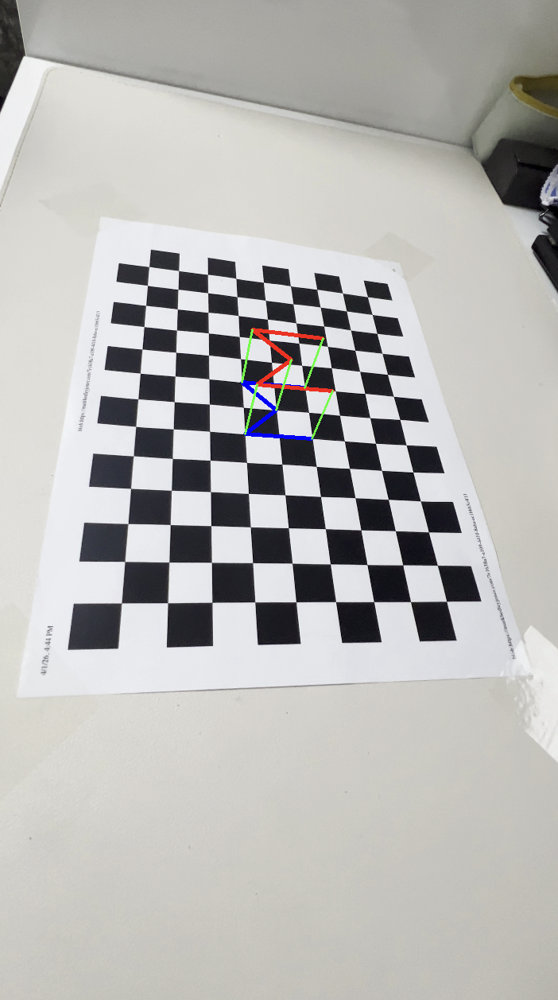
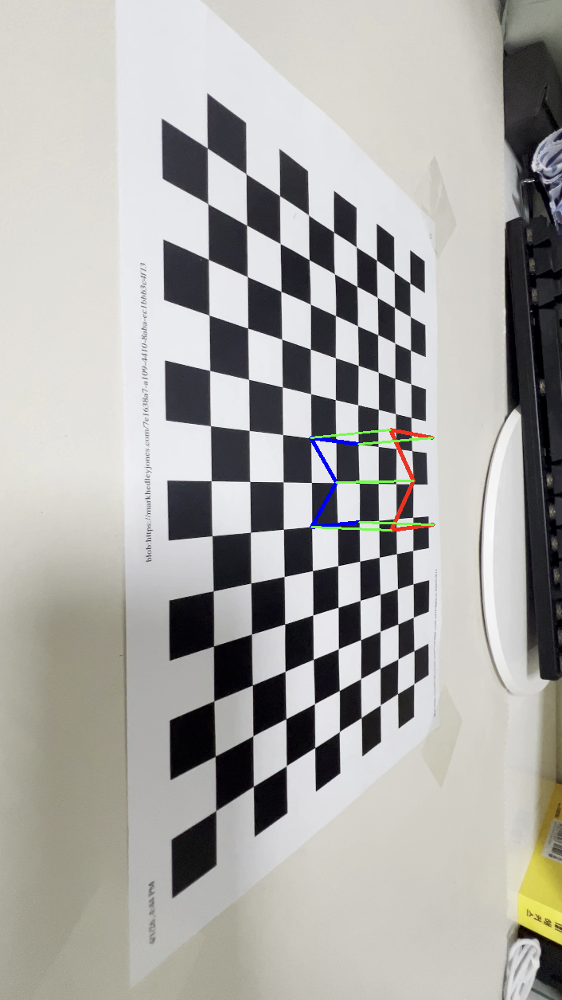
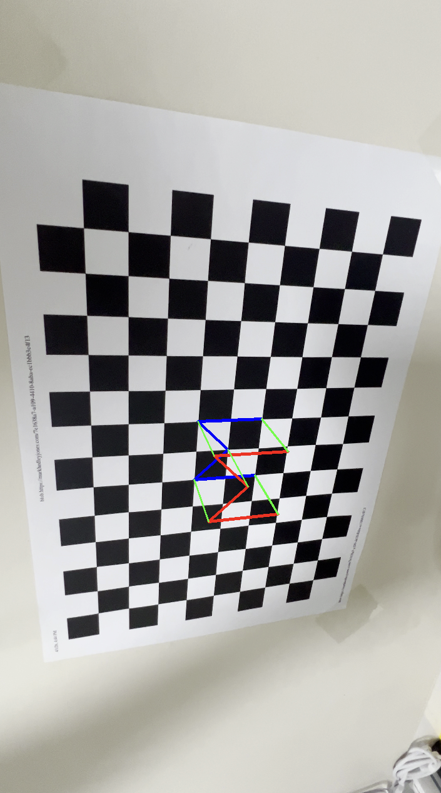
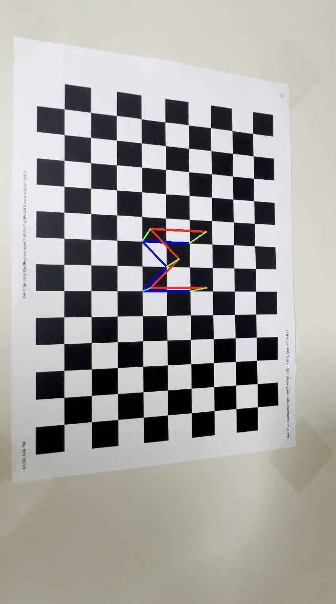

# AR-Initial-Visualizer: 3D Alphabet Rendering on Chessboard

It utilizes the camera's intrinsic parameters to estimate real-time pose from a 13x9 chessboard and renders a 3D initial 'M' in augmented reality (AR).

## 📌 Project Objectives
* Estimate camera pose using personal camera calibration results.
* Display a unique AR object on the video stream, distinct from the example code.

## ✨ Key Features
* **Camera Pose Estimation** : Calculates the camera's rotation ($rvec$) and translation ($tvec$) vectors from the chessboard pattern.
* **AR Object Visualization** : Instead of a simple box, a custom 3D 'M' structure was designed and projected onto the center of the chessboard.
* **Real-time Optimization**: Resizes the original 4K video to HD (720p) to ensure smooth real-time rendering on the MacBook Pro M4 environment.

## 🛠️ Technical Details

### 1. Camera Matrix ($K$)
The precise intrinsic parameters obtained from the previous assignment (HW3) were applied.
$$ 
K = \begin{bmatrix} 1922.61898 & 0 & 1091.79010 \\ 0 & 1926.59005 & 1908.48807 \\ 0 & 0 & 1 \end{bmatrix} 
$$

### 2. Implementation Algorithms
* **PnP (Perspective-n-Point)**: Estimates the camera pose by using 3D world points and their corresponding 2D image points.
* **3D Point Projection**: Projects the 3D coordinates of the designed alphabet vertices onto the image plane.

## 🖼️ Results
These are the demonstration screenshots.

| View 1 | View 2 | View 3 | View 4 |
| :---: | :---: | :---: | :---: |
|  |  |  |  |

## 🚀 How to Run
1. Install required libraries: `pip install numpy opencv-python`
2. Run the program: `python m_visualizer.py`
